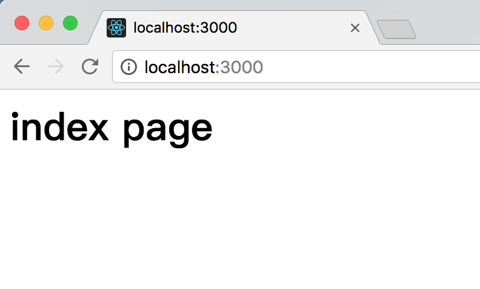
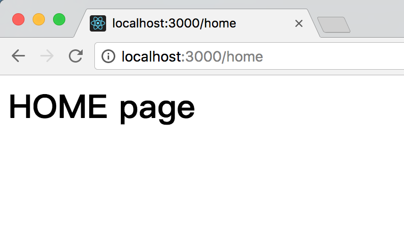
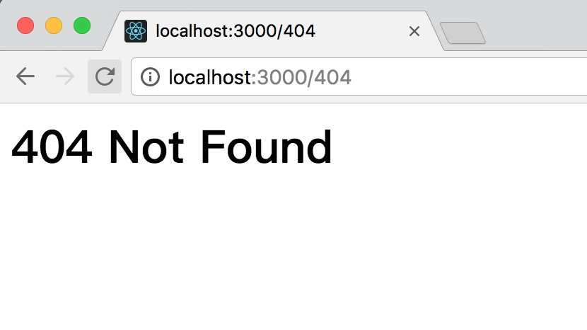

# 路由 koa-router

上一节我们学习了中间件的基本概念，本节主要带大家学习下koa-router路由中间件的使用方法。
<br/>
路由是用于描述URL与处理函数之间的对应关系的。比如用户访问`http://localhost:3000/`，那么浏览器就会显示index页面的内容，如果用户访问的是`http://localhost:3000/home`，那么浏览器应该显示home页面的内容。
<br/>
要实现上述功能，如果不借助koa-router或者其他路由中间件，我们自己去处理路由，那么写法可能如下所示：

```
app.use(async (ctx, next) => {
    if (ctx.request.path === '/') {
        ctx.response.body = 'index page';
    } else {
        await next();
    }
});
app.use(async (ctx, next) => {
    if (ctx.request.path === '/home') {
        ctx.response.body = 'HOME page';
    } else {
        await next();
    }
});
app.use(async (ctx, next) => {
    if (ctx.request.path === '/404') {
        ctx.response.body = '404 Not Found';
    } else {
        await next();
    }
});
```
上述代码中，由`async`标记的函数称为异步函数，在异步函数中，可以用`await`调用另一个异步函数，这两个关键字将在ES7中引入。参数`ctx`是由koa传入的，封装了request和response的变量，我们可以通过它访问request和response，`next`是koa传入的将要处理的下一个异步函数。
<br/>
这样的写法虽然能够处理简单的应用，但是，一旦要处理的URL多起来就会显得特别笨重。所以我们可以借助koa-router来更简单的实现这一功能。

## 安装koa-router
通过npm命令直接安装：
```
npm install koa-router --save
```
## 使用方法
在app.js中使用koa-router来处理URL，代码如下：
```
const Koa = require('koa');

// 注意require('koa-router')返回的是函数:
const router = require('koa-router')();

const app = new Koa();

// add url-route:
router.get('/', async (ctx, next) => {
    ctx.response.body = `<h1>index page</h1>`;
});

router.get('/home', async (ctx, next) => {
    ctx.response.body = '<h1>HOME page</h1>';
});

router.get('/404', async (ctx, next) => {
    ctx.response.body = '<h1>404 Not Found</h1>';
});

// add router middleware:
app.use(router.routes());

app.listen(3000);
console.log('app started at port 3000...');
```
运行app.js:
```
nodemon app.js
```
注意，如果发生报错，那么可能你的node版本还不支持`async`和`await`，需要把node升级到`v7.6.0`以上才能支持。或者使用一些第三方的async库来支持。

在浏览器中访问`http://localhost:3000/`



在浏览器中访问`http://localhost:3000/home`



在浏览器中访问`http://localhost:3000/404`



当然，除了`GET`方法，koa-router也支持处理其他请求方法：
```
router
  .get('/', function (ctx, next) {
    ctx.body = 'Hello World!';
  })
  .post('/users', function (ctx, next) {
    // ... 
  })
  .put('/users/:id', function (ctx, next) {
    // ... 
  })
  .del('/users/:id', function (ctx, next) {
    // ... 
  })
  .all('/users/:id', function (ctx, next) {
    // ... 
  });
```

## 其他特性
### 命名路由
我们可以为路由命名，这样，在开发过程中我们能够很方便的生成和重命名路由：
```
router.get('user', '/users/:id', function (ctx, next) {
 // ... 
});
 
router.url('user', 3);
// => "/users/3" 
```

### 多中间件
```
router.get(
  '/users/:id',
  function (ctx, next) {
    return User.findOne(ctx.params.id).then(function(user) {
      ctx.user = user;
      next();
    });
  },
  function (ctx) {
    console.log(ctx.user);
    // => { id: 17, name: "Alex" } 
  }
);
```

### 嵌套路由
```
var forums = new Router();
var posts = new Router();
 
posts.get('/', function (ctx, next) {...});
posts.get('/:pid', function (ctx, next) {...});
forums.use('/forums/:fid/posts', posts.routes(), posts.allowedMethods());
 
// responds to "/forums/123/posts" and "/forums/123/posts/123" 
app.use(forums.routes());
```

### 路由前缀
```
var router = new Router({
  prefix: '/users'
});
 
router.get('/', ...); // responds to "/users" 
router.get('/:id', ...); // responds to "/users/:id" 
```

### URL 参数
参数会被添加到`ctx.params`中
```
router.get('/:category/:title', function (ctx, next) {
  console.log(ctx.params);
  // => { category: 'programming', title: 'how-to-node' } 
});
```
路由其实也支持正则表达式，这是一个非常方便的功能，我们可以为一组类似的URL写一个正则去匹配。

到现在为止，修改之后的代码，比起原来已经有一些优化了，但是还不够。我们可以把路由匹配单独抽象成一个`router.js`文件，把所有路由的映射关系都写在这个文件中。然后再建一个`controller`文件夹，把所有的处理函数都写在这里。在后面的章节中我们会详细介绍。

